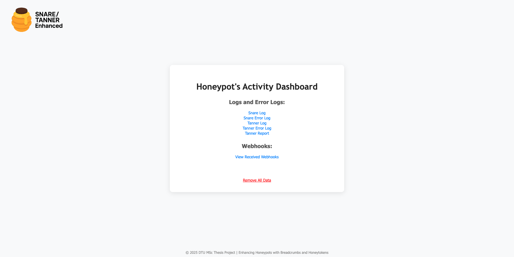

# Enhancing SNARE/TANNER with LLM-driven Breadcrumbing and Honeytokens Generation


This honeypot framework builds upon the [SNARE](https://github.com/mushorg/snare)/[TANNER](https://github.com/mushorg/tanner/tree/main) honeypot implementation from [T-Pot](https://github.com/telekom-security/tpotce/tree/master) which is designed attract and log interactions on web applications. Within this framework, we extend and enhance SNARE/TANNER by integrating breadcrumbing techniques and honeytokens deployment utilizing LLMs for a better and deeper deceptive honeypot framework.

## Overall Features

- **Build Upon SNARE/TANNER**: This framework extends SNARE/TANNER honeypot from T-Pot by introducing more advanced deception technique features using breadcrumbing and honeytoken deployment with LLM-driven generation.
- **Breadcrumbs**: This framework have an implemented mechanism to deploy breadcrumbs within a web application utilzing the three different strategies: `robots.txt`, `error pages`, and `html inline comments`.
- **Honeytokens**: This framework includes a mechanism to deploy honeytoken files utilized from [Canarytoken](https://canarytokens.org/nest/generate) including their content, designed to detect unauthorized access. The types of honeytokens supported includes the file types: `docx`, `xlsx`, and `pdf`.
- **Bait Files**: This framework create bait files together with the honeytokens which mimic files that could be exploited. These files are strategically placed to lure the attacker.
- **Utilizing LLMs**: The framework leverages Large Language Models (LLMs) to dynamically generate realistic honeytokens and breadcrumbs content which enhances the deception capabilities of the honeypot.
- **Logging Interface**: The honeypot framework introduces a logging interface for monitoring and analyzing activities in SNARE/TANNER. It captures triggered honeytokens from webhooks which provides insights into the intruders with detailed information about them.

## User Guide

In this section, we describe how to set up and run the enhanced honeypot framework for LLM-driven honeytoken and breadcrumb generation.

### Prerequirements

In order to run the enhanced SNARE/TANNER honeypot framework, ensure the following are installed on the host system:

- Docker & Docker Compose (it is **recommended** to install docker desktop which includes both)
- Certbot (for running with TLS on own domain)
- Python (v. 3.10 or later)

### Configuration in SNARE
The features for the enhanced honeypot is configured using a `config.yml` file created for SNARE which can be found at the path `/docker/snare/dist`. 

Below is an explanation of the key sections in the configuration file:

- **`FEATURES`**: Parameter to enable or disable the extended framework to generate honeytokens and breadcrumbs.
- **`DOMAIN`**: Variable specifying the domain name used for running the framework with TLS.
- **`HONEYTOKEN`**: Specifies the honeytokens associated LLM API and prompt used for generating. At the moment we support [Gemini AI](https://aistudio.google.com/prompts/new_chat) from Google and the [Inference API](https://huggingface.co/docs/inference-providers/index) from Hugging Face. Furthermore, it gives the opportunity to specific a accesible webhook endpoint when triggering a honeytoken.
- **`BREADCRUMB`**: Configures the types of breadcrumbs used and the associated LLM. It furthermore provide options to configure the LLM prompt in each of the used breadcrumb strategies.

Configurable fields for both the **HONEYTOKEN** and **BREADCRUMB** components:

- **API-PROVIDER**: The provider of the LLM-API which can be used with `gemini` or `huggingface`
- **API-ENDPOINT**: The endpoint where the API-request to the LLM provider is sent. 
- **API-KEY**: The API-key to the LLM-API from the API-provider.
- **LLM-PARAMETERS**: A set of parameters that control the behavior of the LLM:
  - `temperature`: Controls the randomness of the output where higher values (e.g., 1.5) produce more diverse results.
  - `top_p`: Specifies the model sampling from where the model considers the smallest set of tokens with a cumulative probability above this threshold (e.g., 0.95 is 95%).
  - `top_k`: Limits the sampling to the top number of tokens (e.g., 50 top tokens).
  - `max_new_tokens`: The maximum number of tokens to generate in the response (e.g., 400 tokens).
  - `do_sample`: Boolean value indicating whether sampling is used instead of greedy decoding (specific to HuggingFace only).
  - `return_full_text`: Boolean value indicating whether the full text, including the prompt, should be returned (specific to HuggingFace only).

Component-specific configuration for **HONEYTOKENS**:

- **PROMPT-FILENAMES**: The prompt instructing the LLM to generate filenames that seems realistic for a web application which is used for both bait and honeytoken files.
- **PROMPT-DOCX**: The prompt for generating realistic document content if a `.docx` file is generated.
- **PROMPT-XLSX**: The prompt for generating realistic spreadsheet data if a `.xlsx` file is generated.
- **WEBHOOK-URL**: The webhook-URL used when running the honeypot locally where webhook data is sent when honeytokens are triggered. The webhook-URL need to be accessible from the IP address of Canarytoken `52.18.63.80`.

Component-specific configuration for **BREADCRUMB**:

- **TYPES**: Specifies the types of breadcrumbs to generate:
  - `robots`: Adding a robots.txt file with placed breadcrumbs.
  - `error_page`: Adding generated breadcrumbs in an error page.
  - `html_comments`: Adding generated breadcrumbs as dev-note comments embedded in HTML code of the index-page.
- **PROMPT-ERROR-PAGE**: The prompt for generating a breadcrumb in the error-page looking as a leftover developer comment.
- **PROMPT-HTML-COMMENT**: The prompt for generating a realistic breadcrumb as a one-line HTML comment that will appears to be a dev-note.

Here is an example `config.yml`:
```yaml
FEATURES:
  enabled: True

DOMAIN:
  BASE_DOMAIN: electronicstore.live

HONEYTOKEN:
  API-PROVIDER: gemini # Options: huggingface, gemini
  API-ENDPOINT: https://generativelanguage.googleapis.com/v1beta/models/gemini-2.0-flash
  API-KEY: foobar123
  PROMPT-FILENAMES: >
    You are generating bait filenames for a website called electronicstore.live, which sells smart gadgets and electronics online.
    Generate in total 5 files. The generated files should be realistic, code-friendly filenames (no spaces or special characters) that might contain sensitive internal data.
    Examples include inventory backups, customer exports, admin data, supplier lists, or device configuration dumps.
    {session}
    Use only the file types .docx, .xlsx, .pdf, .db, .sql or .zip and ensure there is minumum one .docx, one .xlsx and one .pdf file.
  PROMPT-DOCX: >
    Given the file name {honeytoken}, generate content for a realistic-looking internal document that would plausibly appear in a document with that name.
    The tone should match the filename — e.g., meeting notes, credentials, export summaries, or sensitive business context.
    The content should be for a smart gadget store. Make it {dynamic}.
    Do not explain your answer, just return the document's content.
  PROMPT-XLSX: >
    Your task is to generate realistic-looking Excel spreadsheet data for a file named {honeytoken}, need between 10 to 20 rows of data.
    Format each row as a comma-separated line, using appropriate column headers based on the filename.
    The content should be for a smart gadget store. Make it {dynamic}.
    Do not explain your answer, just return the raw spreadsheet data.
  LLM-PARAMETERS:
    temperature: 1.3
    top_p: 0.95
    top_k: 50
    max_new_tokens: 400
    do_sample: true # Only for HuggingFace
    return_full_text: false # Only for HuggingFace
  WEBHOOK-URL:    # Only for local deployment

BREADCRUMB:
  TYPES: # Options: robots, error_page, html_comments
  - robots
  - error_page
  - html_comments
  API-PROVIDER: gemini # Options: huggingface, gemini
  API-ENDPOINT: https://generativelanguage.googleapis.com/v1beta/models/gemini-2.0-flash
  API-KEY: foobar123
  PROMPT-ERROR-PAGE: >
    Write a short HTML bait line (in a <p> tag) that subtly hints at an internal file located at /{honeytoken}. 
    It should look like something a developer accidentally left in, referencing the file path naturally.
    Your goal is to lead a potential attacker to believe that this is a legitimate file path. 
  PROMPT-HTML-COMMENT: >
    Write a realistic one-line HTML comment like a developer's note.
    It should mention /{honeytoken} as if it's a config file or temporary log.
    Do NOT include HTML tags or '--'. Make it look like leftover debug info."
  LLM-PARAMETERS:
    temperature: 0.9
    top_p: 0.95
    top_k: 50
    max_new_tokens: 50
    do_sample: true # Only for HuggingFace
    return_full_text: false # Only for HuggingFace
```

### Running Locally with Docker (without TLS-certificate required)

1. Build and Run the local Docker compose file `docker-compose-local.yml`:
   
     ```bash
     docker compose -f docker/docker-compose-local.yml up --build
     ```

### Setting up a TLS-certificate (domain required)

Before running the web application honeypot with TLS, you need to obtain and install a valid certificate for your domain (e.g., electronicstore.live). This needs to be set up from [Let’s Encrypt using Certbot](https://certbot.eff.org/):

1. Install Certbot on your system that is going to host the web application honeypot:

    ```bash
    sudo apt-get update && sudo apt-get install certbot
    ```
    
2. Request a certificate for your domain:
   
    ```bash
    sudo certbot certonly --standalone -d electronicstore.live
    ```

3. The following certificates will be stored under `/etc/letsencrypt/live/{domain_name}/` on the host system:

- `fullchain.pem`
- `privkey.pem`


### Running with Docker (with TLS-certificate required)

1. Build and Run the Docker compose file `docker-compose.yml`:
   
     ```bash
     docker compose -f docker/docker-compose.yml up --build
     ```

Within the application code, TLS is enabled when IS_LOCAL is not set to true. Here is a code snippet of that take part of it in the file `/snare/snare/server.py`:

```python
is_local = os.getenv("IS_LOCAL", "false").lower() == "true"

if not is_local:
    base_domain = SnareConfig.get("DOMAIN", "BASE_DOMAIN")
    ssl_context = ssl.create_default_context(ssl.Purpose.CLIENT_AUTH)
    ssl_context.load_cert_chain(
      certfile=f'/etc/letsencrypt/live/{base_domain}/fullchain.pem',
      keyfile=f'/etc/letsencrypt/live/{base_domain}/privkey.pem'
    )
    site = web.TCPSite(
        self.runner,
        self.run_args.host_ip,
        self.run_args.port,
        ssl_context=ssl_context
    )
else:
    site = web.TCPSite(
        self.runner,
        self.run_args.host_ip,
        self.run_args.port
    )
```

## Logging Interface

Building and running the honeypot using docker will also build and run a logging interface built in Python using [`gunicorn`](https://gunicorn.org/) - providing a WSGI HTTP server from Unix - with HTML-templates.
The logging interface provides real-time insights into honeypot activity of the SNARE and TANNER services respectively through a user-friendly dashboard that is easy to navigate.

The key functionalities include:
- **Browse Logs & Errors**: The logging interface enables the user to view and navigate through system logs and error logs for both SNARE & TANNER. Every log and error log entry is saved until the data is removed.
- **Browse Received Webhooks**: The logging interface enables the user to view received webhooks for the triggered honeytokens - which is data sent from canarytoken. All webhooks is kept infinitely until data is removed. 
- **Export Logs, Errors & Webhook Data**: The interface gives the options to download all logs and error logs in their respective formats for further analysis.
- **Clear Logs & Webhooks**: The interface allows the user to reset the captured logs by clearing either individual logs or all logs and webhooks.
- **Real-Time Updates**: The interface dynamically updates the logs and webhook data when new data is received which provides real-time insights into honeypot activity without having to refresh the page.

### Navigating the Interface

To open the logging interface, open your browser at `http://localhost:5003` or `http://0.0.0.0:5003` from where the index-page will get showed. Each log and error log types (e.g., snare.log, tanner.err) together with the webhooks is accessible via dedicated sections showed on the index-page, and users can seamlessly switch between them using the navigation menu. In the danger-zone, the user can delete all logs and by then reset the whole logging interface.



When opening one of the sections, logs are displayed in reserve chronological order for easier access to the newest and most recent entries. The specific log can be downloaded clicking the blue button in the below corner to the right. In the same corner, the user is able to clean the log, error log or saved webhooks when browsing the specific section by clicking the red button in the below right corner.

## Licenses

This project incorporates the SNARE/TANNER honeypot code and the docker deployment code from T-Pot and is therefore built on using the following GPLv3 licenses:

- [SNARE](https://github.com/mushorg/snare/blob/main/LICENSE)
- [TANNER](https://github.com/mushorg/snare/blob/main/LICENSE)
- [T-Pot](https://github.com/telekom-security/tpotce/blob/master/LICENSE)
