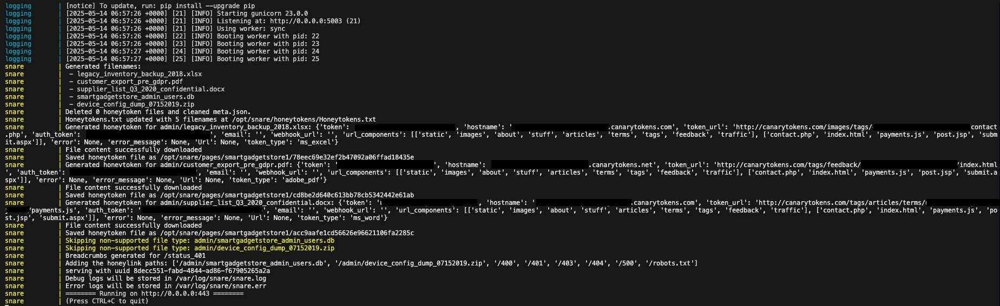

# Enhancing SNARE/TANNER with LLM-driven Breadcrumbs and Honeytokens


This honeypot framework builds upon the [SNARE](https://github.com/mushorg/snare)/[TANNER](https://github.com/mushorg/tanner/tree/main) honeypot implementation from [T-Pot](https://github.com/telekom-security/tpotce/tree/master), which is designed to attract and log interactions on web applications. We extend and enhance SNARE/TANNER within this framework by integrating breadcrumbing techniques and honeytokens/honeylinks deployment utilizing LLMs for a better and deeper deceptive honeypot framework. 

## Features

- **Build Upon SNARE/TANNER**: This framework extends SNARE/TANNER honeypot from T-Pot by introducing more advanced deception technique features using breadcrumbing and honeytoken deployment with LLM-driven generation.
- **Honeytokens**: This framework includes a mechanism to deploy honeytoken files utilized from [Canarytoken](https://canarytokens.org/nest/generate), including injecting content generated with an LLM prompt. The honeytokens are designed to detect unauthorized access when someone opens the file. The types of honeytokens supported include the file types: `docx`, `xlsx`, and `pdf`.
- **Honeylinks**: This framework includes a feature to configure and generate honeylinks for those file types which is not supported as honeytokens. When a honeylink is accessed, it triggers an alert by sending a webhook request containing detailed information, such as the source IP, geographic location, and whether the IP is a known Tor exit node.
- **Breadcrumbs**: This framework implements a mechanism to deploy breadcrumbs within a web application utilizing three different strategies: `robots.txt`, `error pages`, and `HTML inline comments`.
- **Utilizing LLMs**: The framework leverages Large Language Models (LLMs) to dynamically generate realistic honeytokens and breadcrumbs file entries and content, which enhances the deception capabilities of the honeypot and helps us to avoid getting fingerprinted.
- **Logging Interface**: The honeypot framework introduces a logging interface for monitoring and analyzing activities in SNARE/TANNER. It captures triggered honeytokens from webhooks, which provides insights into the intruders with detailed information about them. [See this section below](#logging-interface).

### Architecture Diagram

We present an overview of the architecture for the enhanced SNARE/TANNER with the implemented enhanced extension marked in red:


### Honeytokens

We generate honeytokens designed to detect access to the file implemented in `snare/snare/generators/honeytokens.py`. First, the filenames of the honeytokens are generated with the LLM API, which randomly selects a session variant from the following list, making the prompt dynamic to avoid generating the same filenames:

```python
[
    "Make them look realistic enough to fool a junior employee.",
    "Add a touch of urgency, as if the files were hastily generated before a data breach.",
    "Generate filenames that suggest high-value internal data.",
    "Add subtle typos to mimic real human-created filenames.",
    "Include hints that the files may contain payment or billing data.",
    "Mimic filenames you'd find in a disgruntled employee's backup folder.",
    "Make filenames that sound like they belong to a shady reseller.",
    "These files should appear to be exports from a misconfigured admin panel.",
    "Generate filenames a tech-savvy intern might name while cutting corners.",
    "Suggest these files were auto-exported by outdated internal tools.",
    "Use naming that implies secret supplier pricing or vendor deals.",
    "Pretend these were pulled during a compliance audit and never cleaned up.",
    "Make them look like reports prepared for a board meeting.",
    "Make filenames that feel 'too confidential' to be in a public directory.",
    "Give filenames that a hacker might think hold admin credentials.",
    "Mimic a leak from someone trying to expose shady practices.",
    "Make them just boring enough to avoid suspicion, but still clickable.",
    "Generate filenames that feel 'forgotten but dangerous'.",
    "Pretend these were copied quickly during an office shutdown.",
    "Include clues that this is from an older abandoned staging server.",
    "Generate as if the files were archived manually by someone non-technical.",
    "Imply customer PII may be inside, without being too obvious.",
    "These filenames should provoke curiosity and suspicion.",
    "Make the files look like juicy but plausible corporate documents.",
    "Name them like attachments from a whistleblower email."
]
```
After generating the filenames, we add a randomly selected prefix from the following list, which we join with the filename and add as entries in our web application:

```python
["wp-admin", "admin", "includes", "cgi-bin", "private", "search", "action", "modules", "filter/tips", "comment/reply", "node/add"]
```

The feature integrates with the REST API from [Canarytoken](https://canarytokens.org) to generate and download the files in the formats `docx`, `xlsx`, and `pdf` as honeytokens. These files are enriched with content generated by LLMs to make them appear realistic and enticing for attackers. The injected content could be fake internal memos or fabricated financial data. To make the prompt more dynamic, we specify a list of options that we randomly select from and insert into our prompt:

```python
[
    "realistic as the CEO that you are.",
    "boring..",
    "juicy wow!",
    "tempting for a thief!!",
    "simple and clean.",
    "as bland as an IT compliance report.",
    "dripping with secrets.",
    "convincingly corporate.",
    "leaking subtle danger.",
    "quietly explosive.",
    "like it fell off the back of a server.",
    "barely legal.",
    "flashy enough to get flagged by an intern.",
    "low-key shady.",
    "tempting like a forbidden folder.",
    "desperate for a double-click.",
    "one wrong click away from disaster.",
    "suspiciously tidy.",
    "hacked-together brilliance.",
    "just corporate enough to be overlooked.",
    "too good to be left in plain sight.",
    "enticing to someone who knows what to look for.",
    "so juicy it should be encrypted.",
    "hidden in plain sight.",
    "ready to blow the whistle.",
    "like evidence waiting to be found.",
    "seductive in a spreadsheet kind of way.",
    "a little too confidential.",
    "like it belongs in a courtroom.",
    "mistakenly public.",
    "so official it hurts.",
    "a digital honeytrap.",
    "cryptic but obvious.",
    "named for mischief.",
    "almost believable.",
    "from the dark side of the SharePoint.",
    "familiar but threatening.",
    "ticking with legal implications.",
    "worthy of blackmail.",
    "bait for the bold.",
    "quietly screaming 'look at me'.",
    "the filename equivalent of clickbait.",
    "designed to cause a breach report.",
    "innocent enough to be deadly.",
    "sweet as social engineering bait.",
    "just boring enough to be ignored — or not.",
    "suspenseful like a spy novel title.",
    "like a mistake someone made at 2 AM.",
    "a juicy secret disguised as compliance."
]
```

When a honeytoken is opened, it triggers a webhook alert, providing detailed information about the event, including the time, source IP, and other metadata sent from Canarytoken.

### Honeylinks

Our feature deploys honeylinks, which are implemented in `snare/snare/generators/honeylinks.py`, for generated filenames that are not supported for being honeytokens, along with the files in the `config.yml`. When a honeylink is accessed, it triggers an alert by sending a webhook request.

The webhook includes detailed information about the attacker's source IP, the geographic location, which is retrieved from [IP-API](http://ip-api.com), and information about whether the IP is a known TOR exit node retrieved from [the TOR project](https://check.torproject.org/exit-addresses). It is intended to capture data that is not already captured by SNARE/TANNER about who accessed the honeylink.

In the `server.py` of SNARE, we check if the incoming requested path is a part of the list of honeylinks and trigger the webhook if the honeylink has been accessed:

```python
if (SnareConfig.get("FEATURES", "enabled") is True):
    if (self.honeylink_paths) and (path in self.honeylink_paths):
        self.logger.info(f"Honeylink path triggered: {path}")
        self.hl.trigger_honeylink_alert(data=data)
```

### Breadcrumbs

With our feature, we deploy breadcrumbs to lure an attacker into triggering our honeytokens and honeylinks, implemented in `snare/snare/generators/breadcrumbs.py`. Based on the user's configuration, we are using the three strategies:

1. **`robots.txt`**: We add a `robots.txt` file which includes entries pointing to fake directories, honeytokens, and honeytlinks. These entries are dynamically generated by selecting honeytokens or honeylinks from the tracking file (`Honeytokens.txt`). `robots.txt` is updated to include the disallowed paths with a minimum of one randomly selected honeytoken file, together with all the honeylink files and the fake paths `/private/`, `/admin/`, `/admin/login.php`, and the sitemap `https://smartgadgetstore.live/sitemap.xml`:

```python
lines = [
    "User-agent: *",
    ""
] + bait_lines + [
    "Disallow: /private/",
    "Disallow: /admin/",
    "Disallow: /admin/login.php",
    "",
    "Sitemap: https://smartgadgetstore.live/sitemap.xml"
]
```

In the example below, we show how an injected `robots.txt` breadcrumb looks on a web application called smartgadgetstore, referencing the honeytoken `/admin/customer_export_pre_gdpr.pdf` and honeylinks `/admin/device_config_dump_07152019.zip` and `/admin/smartgadgetstore_admin_users.db`:


2. **Error Page**: We add generated content in one of the statically created error pages, randomly selecting a custom error page as `400`, `401`, `403`, or `500` pages. The content is generated using an LLM API (e.g., HuggingFace or Gemini), and the content of the selected error page is updated to include a breadcrumb referencing one of the generated honeytokens.

We ensure a fallback if the generated content is not generated, which populates it with the static error page breadcrumb:

```html
<p>Access /{honeytoken} for diagnostics.</p>
```

In the example below, we show how an injected error page breadcrumb looks on a web application called smartgadgetstore, referencing the honeytoken `/admin/supplier_list_Q3_2020_confidential.docx`:


3. **HTML Embedded Comment**: We place embedded dev-note comments breadcrumb referencing one of the generated honeytokens within the HTML source code of the index page if it exists. The code randomly selects an anchor comment from all the comments already there to place the comment breadcrumb after it. The HTML comment is generated using an LLM API (e.g., HuggingFace or Gemini).

We ensure a fallback if the generated content is not generated, which populates it with the static HTML comments breadcrumb:

```html
<!-- dev ref /{honeytoken} -->
```

In the example below, we show how an injected HTML comment breadcrumb looks on a web application called smartgadgetstore, referencing the honeylink `/admin/smartgadgetstore_admin_users.db`:


## User Guide

In this section, we describe how to set up and run the enhanced honeypot framework for LLM-driven honeytoken and breadcrumb generation.

### Prerequirements

To run the enhanced SNARE/TANNER honeypot framework, ensure the following are installed on the host system:

- Docker & Docker Compose (it is **recommended** to install docker desktop which includes both)
- Certbot (for running with TLS on your own domain)
- Python (v. 3.9 or later)

### Start SNARE

The startup parameters are defined in `start_snare.py`, located at: `\docker\snare\dist\start_snare.py`

On execution, SNARE:

1. Randomly selects a folder from the `dirs` list (each representing a different fake site under `/docker/snare/dist/pages/`).
2. Waits for the Tanner service to become available.
3. Launches SNARE with the listed parameters and the selected page directory.

To list the random fake websites you want SNARE to select from:

- Add their folder name to the `dirs` list in `start_snare.py`.
- Ensure your folder structure and `meta.json` match the required format described below.

### Front Page Setup

SNARE/TANNER serves decoy web pages with all components renamed to their MD5 hash (excluding file extension) and stored under:
`/docker/snare/dist/pages/<page_folder>/`

Although the `SNARE CLONER` tool handles this automatically, some tweaks are required to match our enhanced features.
Required `meta.json` entries for proper operation:

```json
{
    "/index.html": {
        "content_type": "text/html",
        "hash": "44098cc2ee0b1f7dec52e148e28ad706"
    },
    "/wp-admin/load-styles.php?c=0&dir=ltr&load[]=dashicons,buttons,forms,l10n,login&ver=4.9.8": {
        "hash": "71a104cd63ee955a811d73613d691c83",
        "content_type": "text/css"
    },
    "/login.php": {
        "hash": "73dce75d92181ca956e737b3cb66db98",
        "content_type": "text/html"
    },
    "/login.php?action=lostpassword": {
        "hash": "e3ba3fe8e612824a73add7dd724c5a0f",
        "content_type": "text/html"
    },
    "/status_400": {
        "hash": "5d7e7652b9cfb8d8d9fa9602f2ed0efe",
        "content_type": "text/html"
    },
    "/status_401": {
        "hash": "a75ed9a62c8e44bc58f32d10551b3855",
        "content_type": "text/html"
    },
    "/status_403": {
        "hash": "05a190c1ac225372f0c0c0c74b07a687",
        "content_type": "text/html"
    },
    "/status_404": {
        "hash": "5a2bce9d53f443761357fef4f5674ca7",
        "content_type": "text/html"
    },
    "/status_500": {
        "hash": "c6e0e90edba7b3d7d91dc07d9e10fc34",
        "content_type": "text/html"
    },
    "/admin/login.php": {
        "hash": "5f404c514b42b2b2fa588f4c56a6e54b",
        "content_type": "text/html"
    }
}
```
After it is confirmed that the entries above are included, a manual adjustment of the HTML code to redirect to the correct endpoints is necessary. For example main page should be index.html, the login should be login.php, etc.
These static files (except index.html) are ready to be used and included in the folder `templates`, located here: `\docker\snare\dist\templates`

To use a custom webpage:

1. MD5-hash each file and rename it (no extension).
2. Place files in a folder under `/docker/snare/dist/pages/`.
3. Add a `meta.json` in that folder with original paths, hashes, and MIME types.


### Configuration in SNARE
The features for the enhanced honeypot are configured using a `config.yml` file created for SNARE, which can be found at the path `/docker/snare/dist`. 

Below is an explanation of the key sections in the configuration file:

- **`FEATURES`**: Specify a parameter to enable or disable the extended framework to generate honeytokens, honeylinks, and breadcrumbs. Furthermore, it specifies the webhook URL used when running the honeypot locally and when fully deployed (which requires the public IP of the hosting server). The URL is where webhook data is sent to when honeytokens and honeylinks are triggered. The webhook URL always needs to be accessible from the IP address of Canarytoken `52.18.63.80`.
- **`DOMAIN`**: Variable specifying the base domain name used for running the framework with TLS.
- **`HONEYTOKEN`**: Specifies the honeytokens associated LLM API and prompt used for generating. At the moment, we support [Gemini AI](https://aistudio.google.com/prompts/new_chat) from Google and the [Inference API](https://huggingface.co/docs/inference-providers/index) from Hugging Face. Furthermore, it gives the opportunity to specify an accessible webhook endpoint when triggering a honeytoken.
- **`HONEYLINK`**: Specifies the fixed honeylink paths to trigger on. The static paths will be added together with the dynamic paths from the generated filenames of those file types for which we do not support the honeytoken generation.
- **`BREADCRUMB`**: Configures the types of breadcrumbs used and the associated LLM. It furthermore provides options to configure the LLM prompt in each of the used breadcrumb strategies.

Configurable fields for the **HONEYTOKEN** and **BREADCRUMB** components:

- **API-PROVIDER**: The provider of the LLM-API, which can be used with `gemini` or `huggingface`
- **API-ENDPOINT**: The endpoint where the API request to the LLM provider is sent. 
- **API-KEY**: The API-key to the LLM-API from the API-provider.
- **LLM-PARAMETERS**: A set of parameters that control the behavior of the LLM:
  - `temperature`: Controls the randomness of the output, where higher values (e.g., 1.5) produce more diverse results.
  - `top_p`: Specifies the model sampling from where the model considers the smallest set of tokens with a cumulative probability above this threshold (e.g., 0.95 is 95%).
  - `top_k`: Limits the sampling to the top number of tokens (e.g., 50 top tokens).
  - `max_new_tokens`: The maximum number of tokens to generate in the response (e.g., 400 tokens).
  - `do_sample`: Boolean value indicating whether sampling is used instead of greedy decoding (specific to HuggingFace only).
  - `return_full_text`: Boolean value indicating whether the full text, including the prompt, should be returned (specific to HuggingFace only).

Component-specific configuration for **HONEYTOKENS**:

- **PROMPT-FILENAMES**: The prompt instructing the LLM to generate filenames that seem realistic for a web application, which is used for both bait and honeytoken files. It **must include the `session` variable** to ensure that filename generation is dynamic and not the same at each session by randomly selecting between a list of options.
- **PROMPT-DOCX**: The prompt for generating realistic document content if a `.docx` file is generated. It **must include the `honeytoken` and `dynamic` variable**. The `honeytoken` variable represents the filename of the token generated in the **PROMPT-FILENAMES** output. The `dynamic` variable ensures that generation is dynamic and not the same at each session by randomly selecting from a list of options.
- **PROMPT-XLSX**: The prompt for generating realistic spreadsheet data if a `.xlsx` file is generated. It **must include the `honeytoken` and `dynamic` variable**. The `honeytoken` variable represents the filename of the token generated in the **PROMPT-FILENAMES** output. The `dynamic` variable ensures that generation is dynamic and not the same at each session by randomly selecting from a list of options.

Component-specific configuration for **BREADCRUMB**:

- **TYPES**: Specifies the types of breadcrumbs to generate:
  - `robots`: Adding a robots.txt file with placed breadcrumbs.
  - `error_page`: Adding generated breadcrumbs in an error page.
  - `html_comments`: Adding generated breadcrumbs as dev-note comments embedded in the HTML code of the index page.
- **PROMPT-ERROR-PAGE**: The prompt for generating a breadcrumb in the error page looks like a leftover developer comment. It **must include the `honeytoken` variable** which represents the filename of the token generated in the **PROMPT-FILENAMES** output.
- **PROMPT-HTML-COMMENT**: The prompt for generating a realistic breadcrumb as a one-line HTML comment that will appear to be a dev-note. It **must include the `honeytoken` variable** which represents the filename of the token generated in the **PROMPT-FILENAMES** output.

Here is an example `config.yml`:
```yaml
FEATURES:
  enabled: True
  WEBHOOK-URL-LOCAL: https://webhook.site/1234 # Only for local deployment
  WEBHOOK-URL-DEPLOYMENT: http://{public_ip}:5003/webhook # Only for Deployment using docker-compose.yml

DOMAIN:
  BASE_DOMAIN: electronicstore.live

HONEYTOKEN:
  API-PROVIDER: gemini # Options: huggingface, gemini
  API-ENDPOINT: https://generativelanguage.googleapis.com/v1beta/models/gemini-2.0-flash
  API-KEY: foobar123
  PROMPT-FILENAMES: > # Need to include "session" variable
    You are generating bait filenames for a website called electronicstore.live, which sells smart gadgets and electronics online.
    Generate in total 5 files. The generated files should be realistic, code-friendly filenames (no spaces or special characters) that might contain sensitive internal data.
    Examples include inventory backups, customer exports, admin data, supplier lists, or device configuration dumps.
    {session}
    Use only the file types .docx, .xlsx, .pdf, .db, .sql or .zip and ensure there is minumum one .docx, one .xlsx and one .pdf file.
  PROMPT-DOCX: > # Need to include "honeytoken" and "dynamic" variable
    Given the file name {honeytoken}, generate content for a realistic-looking internal document that would plausibly appear in a document with that name.
    The tone should match the filename — e.g., meeting notes, credentials, export summaries, or sensitive business context.
    The content should be for a smart gadget store. Make it {dynamic}.
    Do not explain your answer, just return the document's content.
  PROMPT-XLSX: > # Need to include "honeytoken" and "dynamic" variable
    Your task is to generate realistic-looking Excel spreadsheet data for a file named {honeytoken}, need between 10 to 20 rows of data.
    Format each row as a comma-separated line, using appropriate column headers based on the filename.
    The content should be for a smart gadget store. Make it {dynamic}.
    Do not explain your answer, just return the raw spreadsheet data.
  LLM-PARAMETERS:
    temperature: 1.1
    top_p: 0.95
    top_k: 50
    max_new_tokens: 400
    do_sample: true # Only for HuggingFace
    return_full_text: false # Only for HuggingFace

HONEYLINK:
  STATIC-PATHS: # Set static path to trigger honeylink
    - /400
    - /401
    - /403
    - /404
    - /500
    - /robots.txt

BREADCRUMB:
  TYPES: # Options: robots, error_page, html_comments
  - robots
  - error_page
  - html_comments
  API-PROVIDER: gemini # Options: huggingface, gemini
  API-ENDPOINT: https://generativelanguage.googleapis.com/v1beta/models/gemini-2.0-flash
  API-KEY: foobar123
  PROMPT-ERROR-PAGE: > # Need to include "honeytoken" variable
    Write a short HTML bait line (in a <p> tag) that subtly hints at an internal file located at /{honeytoken}. 
    It should look like something a developer accidentally left in, referencing the file path naturally.
    Your goal is to lead a potential attacker to believe that this is a legitimate file path. 
  PROMPT-HTML-COMMENT: > # Need to include "honeytoken" variable
    Write a realistic one-line HTML comment like a developer's note.
    It should mention /{honeytoken} as if it's a config file or temporary log.
    Do NOT include HTML tags or '--'. Make it look like leftover debug info."
  LLM-PARAMETERS:
    temperature: 1.1
    top_p: 0.95
    top_k: 50
    max_new_tokens: 50
    do_sample: true # Only for HuggingFace
    return_full_text: false # Only for HuggingFace
```

### Running Locally with Docker Compose (without TLS certificate required)

1. Clone and Navigate to the Repository from GitHub:

   ```bash
   git clone https://github.com/Veiglin/snare-tanner-enhanced.git
   cd ./snare-tanner-enhanced
   ```

2. Build and run the local Docker compose file `docker-compose-local.yml`:
   
     ```bash
     docker compose -f docker/docker-compose-local.yml up --build
     ```

In the example below, we show the terminal of SNARE when we run docker compose, which injects honeytokens and breadcrumbs on the web application called smartgadgetstore which we have created a template:



### Setting up a TLS certificate (domain required)

Before running the web application honeypot with TLS, you need to obtain and install a valid certificate for your domain (e.g., electronicstore.live). This needs to be set up from [Let’s Encrypt using Certbot](https://certbot.eff.org/):

1. Install Certbot on your system that is going to host the web application honeypot:

    ```bash
    sudo apt-get update && sudo apt-get install certbot
    ```
    
2. Request a certificate for your domain:
   
    ```bash
    sudo certbot certonly --standalone -d electronicstore.live
    ```

3. The following certificates will be stored under `/etc/letsencrypt/live/{domain_name}/` on the host system:

- `fullchain.pem`
- `privkey.pem`


### Running with Docker Compose (with TLS certificate and domain required)

1. Clone and Navigate to the Repository from GitHub:

   ```bash
   git clone https://github.com/Veiglin/snare-tanner-enhanced.git
   cd ./snare-tanner-enhanced
   ```

2. Build and run the Docker compose file `docker-compose.yml`:
   
     ```bash
     docker compose -f docker/docker-compose.yml up --build
     ```

Within the application code, TLS is enabled when IS_LOCAL is not set to true. Here is a code snippet that takes part of it in the file `/snare/snare/server.py`:

```python
is_local = os.getenv("IS_LOCAL", "false").lower() == "true"

if not is_local:
    base_domain = SnareConfig.get("DOMAIN", "BASE_DOMAIN")
    ssl_context = ssl.create_default_context(ssl.Purpose.CLIENT_AUTH)
    ssl_context.load_cert_chain(
      certfile=f'/etc/letsencrypt/live/{base_domain}/fullchain.pem',
      keyfile=f'/etc/letsencrypt/live/{base_domain}/privkey.pem'
    )
    site = web.TCPSite(
        self.runner,
        self.run_args.host_ip,
        self.run_args.port,
        ssl_context=ssl_context
    )
else:
    site = web.TCPSite(
        self.runner,
        self.run_args.host_ip,
        self.run_args.port
    )
```

## Logging Interface

Building and running the honeypot using Docker will also build and run a logging interface built in Python using [`gunicorn`](https://gunicorn.org/) - providing a WSGI HTTP server from Unix - with HTML templates.
The logging interface provides real-time insights into the honeypot activity of the SNARE and TANNER services, respectively, through a user-friendly dashboard that is easy to navigate.

The key functionalities include:
- **Browse Logs & Errors**: The logging interface enables the user to view and navigate through system logs and error logs for both SNARE & TANNER. Every log and error log entry is saved until the data is removed.
- **Browse Received Webhooks**: The logging interface enables the user to view received webhooks for the triggered honeytokens, which are data sent from the canarytoken. All webhooks are kept indefinitely until data is removed. 
- **Export Logs, Errors & Webhook Data**: The interface gives the options to download all logs and error logs in their respective formats for further analysis.
- **Clear Logs & Webhooks**: The interface allows the user to reset the captured logs by clearing either individual logs or all logs and webhooks.
- **Real-Time Updates**: The interface dynamically updates the logs and webhook data when new data is received, which provides real-time insights into honeypot activity without having to refresh the page.

### Navigating the Interface

To open the logging interface, open your browser at `http://localhost:5003` or `http://0.0.0.0:5003` from where the index page will be shown. Each log and error log type (e.g., snare.log, tanner.err) together with the webhooks is accessible via dedicated sections shown on the index page, and users can seamlessly switch between them using the navigation menu. In the danger zone, the user can delete all logs and then reset the whole logging interface.


When opening one of the sections, logs are displayed in reverse chronological order for easier access to the newest and most recent entries. The specific log can be downloaded by clicking the blue button in the corner to the right. In the same corner, the user can clean the log, error log, or saved webhooks when browsing the specific section by clicking the red button in the bottom right corner.

### SNARE Log

When starting up, SNARE provides debug logs in the SNARE Log section that inform about which honeytokens and breadcrumbs have been generated. 

In the example below, we show how SNARE injected honeytokens and breadcrumbs on the web application called smartgadgetstore:


## Licenses

This project incorporates the SNARE/TANNER honeypot code and the Docker deployment code from T-Pot and is therefore built on using the following GPLv3 licenses:

- [SNARE](https://github.com/mushorg/snare/blob/main/LICENSE)
- [TANNER](https://github.com/mushorg/snare/blob/main/LICENSE)
- [T-Pot](https://github.com/telekom-security/tpotce/blob/master/LICENSE)
